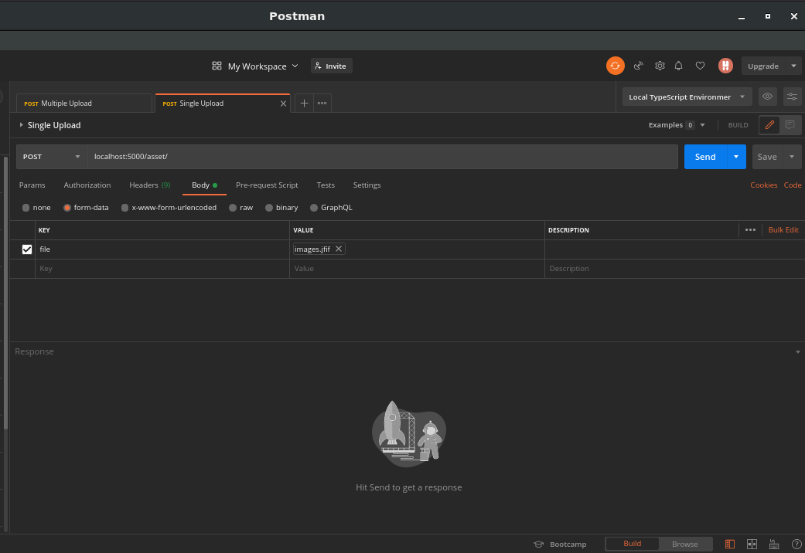

# File Upload using Multer package in Express.js

File Upload is a simple feature, that can be implemented using Multer package. Multer is a package, used as an middleware to upload a file into file system.


As Multer documentation states,
**" Multer is a Node.js Middleware for handling `multipart/form-data` , which is primarily used for uploading files. It is written on top of busboy for maximum efficiency. Multer adds a `body` object and a `file` or `files` object to the request object. The bodyobject contains the values of the text fields of the form, the `file` or `files` object contains the files uploaded via the form. "**


## Step by Step 

**Step 1:** Create a project using npm or yarn if you want, to add a package.json.

`mkdir file-upload && cd file-upload`
`npm init --yes`

<br>

**Step 2:** Install the dependencies.

- express [Minimal framework]
- multer  [Upload Middleware/Library]
- body-parser [Parse Request Body]
- morgan [Application Request Logs]

`npm install express multer body-parser morgan dotenv --save`

**Step 3:** Create app.js and create a simple Express server.

Following code:

```javascript
import express from 'express';
import morgan from  'morgan';
import bodyParser from 'body-parser';

const app = express();

app.listen(process.env.PORT, () =>
  console.log(`App listening on port ${process.env.PORT}`),
);
```

To run the code:

`node app.js`


**Step 4:** I have created a basic structuring of the backend

```bash
├── src/
│   ├── api/
│   │   └── assets
│   │       └── assets-router.js // Asset Router
│   │       └── controller.js    // Asset Controller
│   │       └── service.js       // Asset Services
│   │       └── repository.js    // Asset Repository
│   │       └── model.js         // Asset Model
│   │
│   ├── config/dbConfig          // Database Connectivity
│   │
│   ├── middlewares/uploadFile   // Upload File Multer Middlewares
│   │
│   ├── uploads/                 // Uploaded files will be stored here
│
├── package.json
├── app.js
```


**Step 5:** Next, using the Multer for uploading images. Basically, create a middleware for handling form-data uploaded.

In middleware/uploadFile.js, we have the following snippet

```javascript
import multer from 'multer';
import path from 'path';

const __dirname = path.resolve(path.dirname('')); 


const storage = multer.diskStorage({
    destination: (req, file, cb) => {
      cb(null, path.join(__dirname,'/src/uploads'))
    },
    filename: (req, file, cb) => {
      cb(null, file.fieldname + '-' + Date.now() + path.extname(file.originalname))
    }
});

const upload = multer({storage: storage});

export { upload };

```

Here `destination` is the path where the file will be stored and the `filename` is a parameter responsible for naming the file.

Let's create an endpoint which will upload the file which is in the `src/api/assets/assets-router.js`. And accordingly, add services, repository and models to write business logic, queries and models for database.


**Step 6:** Now, in the `assets-router.js` file, we need to use the `uploadFile` middleware as route-level middleware.

```javascript
import { Router } from "express";
import * as controller from './controller.js';
import * as FileMiddlewares from '../../middlewares/uploadFile.js'

const AssetRouter = Router();


AssetRouter.post('/', FileMiddlewares.upload.single('file'), controller.uploadFile);

AssetRouter.post('/multiple', FileMiddlewares.upload.array('files'), controller.uploadMultipleFile);

AssetRouter.get('/', controller.fetchFiles);


export default AssetRouter;
```

As you see in the above code snippet, Multer supports uploading single as well as multiple uploads.
`upload.single()` is used for uploading a single file. As I have mentioned before multer adds a file object to the request. The file object contains metadata related with the file.

Same way, we can use `upload.array()` instead of `upload.single()` this adds an object files in the request object and used for multiple file uploads.

**Step 7:** Now you can use a RESTful Client such as POSTMAN to test the API, as shown in the below picture.





Now in the project structure, `src/uploads`, you will find the uploaded file and as well as in the `database assets` and `collection asset` the file path is saved already.

**Step 8:** Concluding this simple problem statement. 

You should know, `Multer` will not process any form which is not multipart (multipart/form-data).

Multer adds a body object and a file or files object to the request object. The body object contains the values of the text fields of the form, the file or files object contains the files uploaded via the form.

If you are willing to view the file or fetch that file from the browser, you can retrieve it as static content, using the address,

Example: `localhost:5000/fileName.extension`

- `localhost:5000/simple.png`
- `localhost:5000/simple.pdf`


File upload can be an intimidating topic, but it doesn't have to be hard to implement. With Express and Multer, handling multipart/form-data is easy and straightforward. 

**Note:**
1. Make sure you add `.env` file inside the `./file-upload`.

```javascript
PORT=5000
MONGODB_URL=mongodb://localhost:27017/asset
```