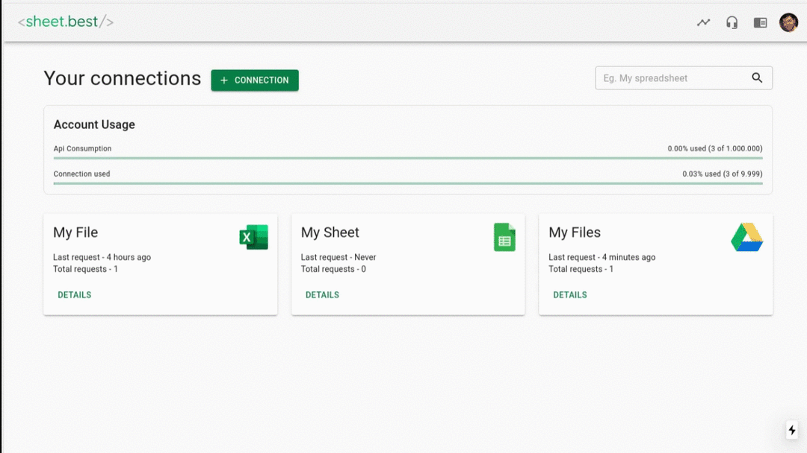
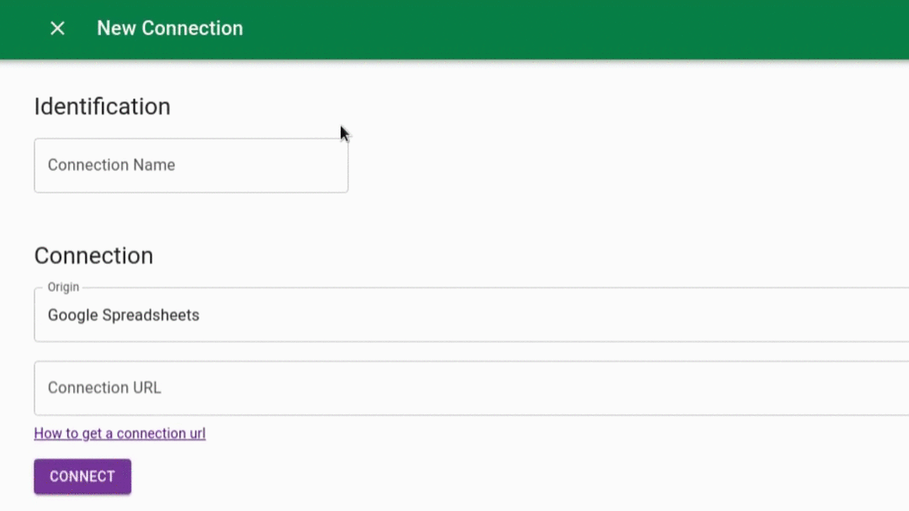
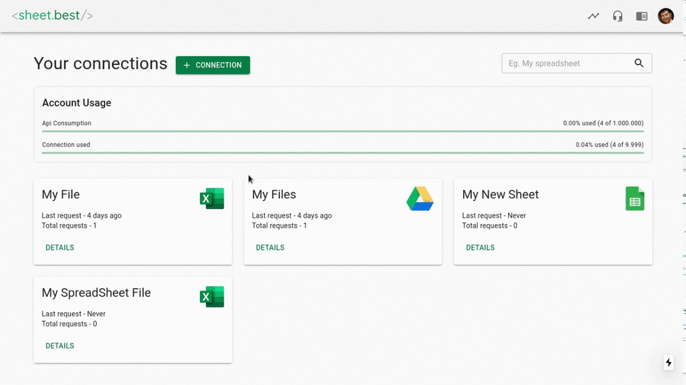

# Using Google Sheets as RESTful API for storing and retrieving data

Posting data to API's has never been easy. To POST form data and GET data API as well from Node.js to the Google Sheets like REST APIs.

Google Sheets APIs will be available as [RESTful architectural style](https://docs.sheet.best/). This quick guide on how to start getting your Sheet data and integrating it to your Node.js application.

## Step by Step


**Step 1:** Create a project using npm or yarn if you want, to add a package.json.

`mkdir google-sheets-rest-api && cd google-sheets-rest-api`
`npm init --yes`

<br>

**Step 2:** Install the dependencies.

- express [Minimal framework]
- dotenv  [Zero-dependency module that loads environment variables]
- node-fetch [window.fetch API]
- morgan [Application Request Logs]

`npm install express multer body-parser morgan dotenv --save`

**Step 3:** Create app.js and create a simple Express server.

Following code:

```javascript
import express from 'express';
import morgan from  'morgan';
import bodyParser from 'body-parser';

const app = express();

app.listen(process.env.PORT, () =>
  console.log(`App listening on port ${process.env.PORT}`),
);
```

To run the code:

`node app.js`


**Step 4:** I have created a basic structuring of the backend

```bash
├── package.json
├── package-lock.json
├── README.md
├── server.js
└── src
    ├── api
    │   └── UserMgmt
    │       ├── controller.js // UserController
    │       ├── router.js     // UserRouter
    │       └── service.js    // UserService
    ├── constants             // Constant files
    │   └── url.js
    └── utils
        └── apiCall.js        // API helper function
```

**Step 5:** Now, create a Google Excel Sheet, and give editor permissions.
<center>
    
</center>

**Step 6:** Login into Google.Sheet-Best application. Create a new connection with the Google Sheet share URL.
<center>
    
</center>

**Step 7:** Name your Connection on the form that have just appeared. Select your Connection Origin within the list. Paste your Connection URL. Click CONNECT button.
<center>
    
</center>

**Step 8:** Click on the DETAILS button for the your new Connection. Your Connection URL will be available for copy on CONNECTION URL section.
<center>
    
</center>


**Step 9:** You can use your Connection URL via REST API through GET, POST, PATCH, PUT and DELETE methods.
```javascript
  // Example Snippet in Node.js:
  function apiCall( method, options, body ) {
        let options = {
            method: method,
            body: JSON.stringify(body),
            mode: "cors",
            headers: {
                "Content-Type": "application/json",
            }
        };
      let data = await fetch("https://sheet.best/api/sheets/cf969697-682a-40e3-bad4-d54803eeeacf", options);
      data = await data.json();
      console.log(data);
      return data;
  }
```